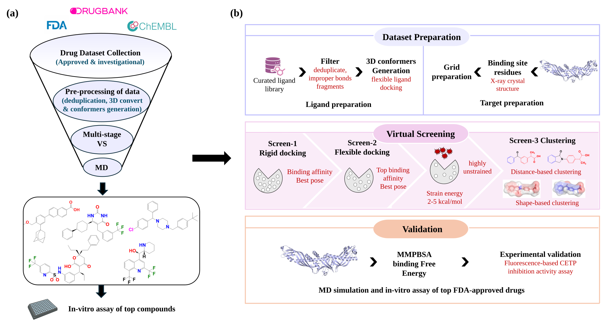

# CETP_drug_repurposing: Structure-Guided Virtual Screening for CETP Inhibitor Repurposing

A multi-stage, structure-based drug-repurposing pipeline that combines molecular docking, ligand strain filtering, consensus clustering, molecular dynamics (MD), MM-PBSA free-energy analysis, and biochemical validation to identify repurposed small-molecule inhibitors of Cholesteryl Ester Transfer Protein (CETP).

Paper: [DOI link — To Be Added]
Preprint: [bioRxiv/ChemRxiv link — To Be Added]
Data (Zenodo): [DOI badge — To Be Added]



## Table of Contents
1. [Abstract](#abstract)
2. [Repository Structure](#repository-structure)
3. [Environment Setup](#environment-setup)
4. [Usage](#usage)
5. [Results](#results)
6. [Citing](#citing)
7. [License](#license)

## Abstract

Cholesteryl ester transfer protein is involved in the transfer of neutral lipids among plasma lipoproteins and represents an established target for modulating lipoprotein metabolism. This study applies a systematic drug-repurposing strategy to identify chemically distinct compounds capable of inhibiting CETP. 
The workflow integrates compound preprocessing, virtual screening, structure-based molecular docking, chemical-similarity and clustering analyses, molecular-dynamics simulations, MM/PBSA calculations, principal-component analysis, free-energy-landscape analysis, and biochemical CETP inhibition assays.

---

## Study Workflow

The study comprises the following stages:

1. **Compound preprocessing**  
   Preparation, standardization, geometry optimization, and filtering of the
   drug library.

2. **Virtual screening**  
   Structure-based screening of the curated library against the CETP
   inhibitor-binding tunnel.

3. **Docking and interaction analysis**  
   Evaluation of docking scores, binding orientations, residue contacts, and
   chemical diversity.

4. **Candidate prioritization**  
   Integration of docking, clustering, similarity, strain-energy, and ADME
   criteria to select structurally diverse candidates.

5. **Molecular-dynamics simulations**  
   Explicit-solvent simulations of CETP–ligand complexes and analysis of
   structural stability and ligand retention.

6. **Post-MD energetic and conformational analyses**  
   MM/PBSA calculations, residue-wise energy decomposition,
   principal-component analysis, free-energy landscapes, and collective-motion
   characterization.

7. **Biochemical validation**  
   Measurement of CETP inhibition for the prioritized repurposing candidates
   using a fluorescence-based activity assay.

8. **Comparative pharmacophore interpretation**  
   Evaluation of common hydrophobic, adaptable, and polar features associated
   with CETP recognition.

---

## Repository Structure

Large/raw outputs (docking pose libraries, MD trajectories, MM-PBSA tables, raw assay reads) live on **Zenodo** — see [Results](#results). This repo holds the code needed to reproduce them.

```
CETP-VS/
├── README.md
├── LICENSE
├── environment.yml
├── CITATION.cff
├── CONTRIBUTING.md
├── requirements.txt
├── .gitignore
│
├── assets/
│   └── graphical_abstract.png
│
├── scripts/
│   ├── assay/
│   ├── clustering/
│   ├── docking/
│   ├── post_md_analysis/
│   └── preprocessing/
│
├── data/
│   └── README.md
│
└── plot_results/
    └── README.md
```

### Script directories

| Directory | Description |
|---|---|
| `scripts/preprocessing/` | Compound preparation, standardization, filtering, and format conversion |
| `scripts/docking/` | Docking-score processing and protein–ligand interaction analysis |
| `scripts/clustering/` | Chemical-similarity calculations, diversity analysis, and compound clustering |
| `scripts/post_md_analysis/` | MD trajectory processing, MM/PBSA, PCA, FEL, and structural analyses |
| `scripts/assay/` | Biochemical assay normalization, inhibition calculations, and plotting |

The complete inputs and outputs required by these scripts are archived in the
associated Zenodo dataset.

---

## Installation

### Clone the repository

```bash
git clone https://github.com/Sudipta-Nandi-IITM/CETP_Drug_Repurposing.git
cd CETP_Drug_Repurposing
```

### Create the Conda environment

```bash
conda env create -f environment.yml
conda activate cetp-repurposing
```

Alternatively, install the Python dependencies using:

```bash
pip install -r requirements.txt
```

Scientific programs such as GROMACS, gmx_MMPBSA, the molecular-docking
software, and molecular-visualization tools must be installed separately.
Their versions and relevant settings are documented in the manuscript and
Zenodo dataset.

---

## Usage

The scripts require the input files deposited in the associated Zenodo
dataset.

### General workflow

1. Download and extract the Zenodo dataset.
2. Create a separate local output directory.
3. Run the required script using the corresponding Zenodo file as input.
4. Store newly generated files outside the original Zenodo dataset directory.

## Data Availability

The complete computational and experimental data supporting this study will be
deposited in Zenodo.

**Zenodo dataset DOI:** `[to be added]`

The Zenodo archive will include:

- compound identifiers and virtual-screening results;
- molecular-docking inputs, parameters, poses, scores, and interaction outputs;
- molecular-dynamics inputs, topologies, trajectories, structures, and logs;
- structural-stability and protein–ligand interaction analyses;
- MM/PBSA inputs, per-frame energies, energetic components, and residue
  decomposition;
- PCA projections, eigenvalues, marginal free-energy profiles, two-dimensional
  free-energy landscapes, and representative basin structures;
- ADME, chemical-similarity, clustering, and strain-energy results;
- raw and processed biochemical CETP assay measurements;
- numerical source data underlying the main and Supporting Information figures.

The GitHub repository contains the analysis scripts and documentation. Large
data files and scientific outputs are intentionally not duplicated here.

Licensed third-party database records are not redistributed. Database
identifiers, provenance, retrieval information, and processing procedures are
provided where permitted.

---

## Reproducibility

The recommended reproduction order is:

```text
Preprocessing
      ↓
Virtual screening and docking
      ↓
Similarity and clustering analysis
      ↓
Molecular-dynamics analysis
      ↓
MM/PBSA and residue decomposition
      ↓
PCA and free-energy landscapes
      ↓
Biochemical assay processing
      ↓
Manuscript figure generation
```

Each script should be executed using the associated files in the Zenodo
dataset. Users are encouraged to retain the original archived data unchanged
and write reproduced outputs to a separate directory.

---

## Citation

Citation information will be updated following publication.

Machine-readable citation metadata are provided in
[`CITATION.cff`](CITATION.cff).

---

## Contributing

Contributions, bug reports, and suggestions are welcome. Please consult
[`CONTRIBUTING.md`](CONTRIBUTING.md) before submitting an issue or pull
request.

For scientific questions concerning the associated study, contact the
corresponding authors directly.

---

## License

The source code and analysis scripts in this repository are licensed under the
**BSD 3-Clause License**.

See [`LICENSE`](LICENSE) for the complete license text.

Original research data generated for the study will be distributed through
Zenodo under the license specified in the corresponding dataset record.
Third-party materials remain subject to their original licenses and terms of
use.

---

## Contact

**Sudipta Nandi**  
[Department of Biotechnology]  
[Indian Institute of Technology Madras]  
Email: [nandi.sudipta5997@gmail.com]  
ORCID: [0009-0007-7818-200X]
